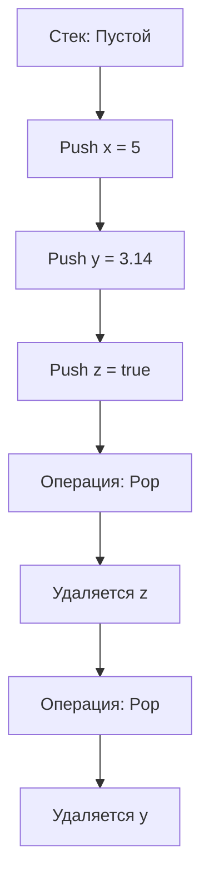
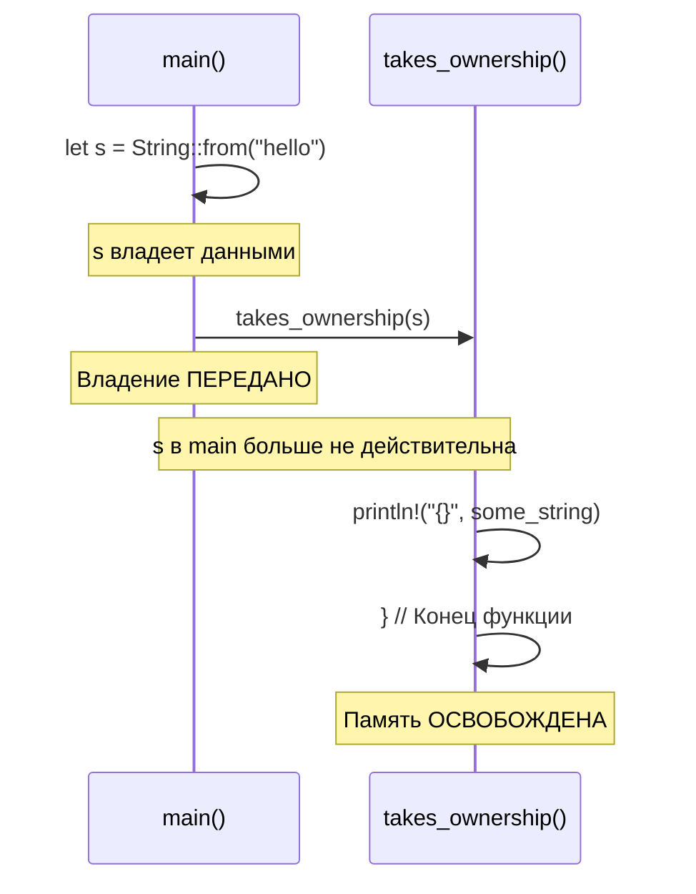

# 🚀 Владение, Заимствование и Жизнь: Глубокая Погружение в Систему Владения Rust

## 📋 Оглавление
1. [Введение](#введение)
2. [Проблема управления памятью](#проблема-управления-памятью)
3. [Стек и Кучи: Архитектурные основы](#стек-и-куча-архитектурные-основы)
4. [Три золотых правила владения](#три-золотых-правила-владения)
5. [Строковый тип String](#строковый-тип-string)
6. [Перемещение значений](#перемещение-значений)
7. [Клонирование и Копирование](#клонирование-и-копирование)
8. [Владение и функции](#владение-и-функции)
9. [Возвращение значений](#возвращение-значений)
10. [Ссылки и Заимствование](#ссылки-и-заимствование)
11. [Изменяемые ссылки](#изменяемые-ссылки)
12. [Висячие ссылки](#висячие-ссылки)
13. [Срезы](#срезы)
14. [Практические примеры](#практические-примеры)
15. [Заключение](#заключение)

---

## 🌟 Введение

### 🎯 Что такое владение в Rust?

**Владение** — это не просто особенность языка Rust, это его философия, фундаментальный принцип, который переворачивает традиционные представления об управлении памятью. Это система, которая позволяет Rust гарантировать безопасность памяти **без использования сборщика мусора** и **без возложения ответственности на программиста** за ручное управление памятью.

```rust
// Владение работает за кулисами
// Вы пишете безопасный код, а Rust заботится о памяти
fn main() {
    let s = String::from("hello"); // Владение начинается здесь
    // Rust автоматически освободит память, когда s выйдет из области видимости
}
```

### 🎨 Почему это революционно?

1. **Безопасность**: Нет segmentation faults, нет use-after-free ошибок
2. **Производительность**: Нет накладных расходов на GC
3. **Детерминизм**: Память освобождается точно в предсказуемый момент
4. **Многопоточность**: Система владения предотвращает гонки данных

---

## 🔥 Проблема управления памятью

### 📊 Исторический контекст

Рассмотрим эволюцию подходов к управлению памятью:

```rust
// 1. Ручное управление (C/C++) - Сложно, подвержено ошибкам
void dangerous_code() {
    char* buffer = malloc(100);  // Забыть free() → утечка памяти
    use_buffer(buffer);
    // Что если использовать после free?
    // Что если освободить дважды?
}

// 2. Сборка мусора (Java, Go, C#) - Удобно, но с накладными расходами
// GC останавливает программу, анализирует память
// Непредсказуемые паузы, большее потребление памяти

// 3. Владение Rust - Лучшее из двух миров
fn safe_rust_code() {
    let data = String::from("data");  // Автоматическое выделение
    // Использование данных
} // Автоматическое освобождение в детерминированный момент
```

### ⚖️ Компромисс "Безопасность vs Производительность"

Rust ломает традиционный компромисс:

| Подход | Безопасность | Производительность | Простота |
|--------|--------------|-------------------|----------|
| Ручное управление | ❌ Низкая | ✅ Высокая | ❌ Сложно |
| Сборка мусора | ✅ Высокая | ❌ Средняя | ✅ Просто |
| **Владение Rust** | ✅ **Высокая** | ✅ **Высокая** | ⚡ **Освоить сложно** |

---

## 🏗️ Стек и Куча: Архитектурные основы

### 📚 Глубокое понимание памяти

#### Стек (Stack) - Быстрая, организованная память

```rust
// Значения в стеке - фиксированного размера
fn stack_example() {
    let x = 5;          // i32 - 4 байта, помещается в стек
    let y = 3.14;       // f64 - 8 байт, помещается в стек
    let z = true;       // bool - 1 байт, помещается в стек
    
    // Все известно на этапе компиляции:
    // - Размер
    // - Время жизни
    // - Расположение
}
```

**Стек работает по принципу LIFO (Last In, First Out):**



**Преимущества стека:**
- ⚡ Молниеносный доступ (O(1))
- 🔄 Автоматическое управление
- 📏 Предсказуемое поведение

**Ограничения стека:**
- 📐 Только фиксированный размер
- 🚫 Нет динамического роста

#### Куча (Heap) - Гибкая, динамическая память

```rust
fn heap_example() {
    // String выделяет память в куче
    let s = String::from("hello");  // Размер неизвестен на этапе компиляции
    
    // Процесс выделения памяти:
    // 1. Запрос места в куче
    // 2. ОС ищет свободный блок
    // 3. Возвращается указатель
    // 4. Данные хранятся по указателю
}
```

**Сравнение структур памяти:**

```mermaid
graph LR
    subgraph "Стек"
        A[Адрес: 0x1000<br/>Значение: 5]
        B[Адрес: 0x1004<br/>Значение: 3.14]
    end
    
    subgraph "Куча"
        C[Адрес: 0x2000<br/>Данные: "hello"]
    end
    
    D[Указатель: 0x2000] --> C
```

**Метафора ресторана:**
- **Стек**: Быстрое обслуживание у стойки, берете и уходите
- **Куча**: Заказ столика в ресторане, требуется время на поиск места

### 🧮 Сравнение производительности

```rust
use std::time::Instant;

fn benchmark() {
    // Тест скорости стека
    let start_stack = Instant::now();
    for _ in 0..1_000_000 {
        let x = 42;  // Стек - мгновенно
    }
    let duration_stack = start_stack.elapsed();
    
    // Тест скорости кучи
    let start_heap = Instant::now();
    for _ in 0..1_000_000 {
        let s = String::from("test");  // Куча - требует выделения
    }
    let duration_heap = start_heap.elapsed();
    
    println!("Стек: {:?}", duration_stack);
    println!("Куча: {:?}", duration_heap);
    // Обычно разница в 10-100 раз!
}
```

---

## 🏆 Три золотых правила владения

### 📜 Правило №1: Один владелец

```rust
// Каждое значение имеет одного и только одного владельца
fn rule_one() {
    let s = String::from("value");  // s - владелец строки
    
    // В этой точке:
    // - s владеет String
    // - String находится в куче
    // - s отвечает за освобождение памяти
}
```

**Неправильно (с точки зрения Rust):**
```rust
fn invalid_multiple_owners() {
    let s1 = String::from("hello");
    let s2 = s1;  // Ошибка! Нельзя иметь двух владельцев
    
    // Что происходит:
    // 1. s1 владеет данными
    // 2. s2 пытается стать владельцем
    // 3. Rust предотвращает эту ситуацию
}
```

### 📜 Правило №2: Единственный владелец в каждый момент времени

```rust
fn rule_two() {
    let mut owner = String::from("I'm the owner");
    
    {
        let new_owner = owner;  // Владение передается
        // owner больше не действителен здесь!
        // new_owner - единственный владелец
    }
    // new_owner выходит из области видимости
    // Память освобождается
}
```

### 📜 Правило №3: Освобождение при выходе из области видимости

```rust
fn rule_three() {
    {
        let s = String::from("temporary");  // Владение начинается
        println!("{}", s);  // Использование
    }  // Здесь s выходит из области видимости
    
    // Автоматически вызывается:
    // drop(s) - освобождает память в куче
    // Гарантированно! Нельзя забыть
}
```

**RAII (Resource Acquisition Is Initialization):**
```rust
// Паттерн из C++, который Rust использует повсеместно
struct Resource {
    data: String,
}

impl Resource {
    fn new(content: &str) -> Self {
        println!("Выделение ресурса");
        Resource {
            data: String::from(content),
        }
    }
}

impl Drop for Resource {
    fn drop(&mut self) {
        println!("Освобождение ресурса: {}", self.data);
    }
}

fn raii_example() {
    let resource = Resource::new("важные данные");
    // Использование ресурса
}  // Автоматически вызывается drop(resource)
```

---

## 📝 Строковый тип String

### 🎭 Строковые литералы vs String

```rust
fn string_comparison() {
    // Строковый литерал
    let literal = "hello";  // Жестко закодирован в бинарник
    
    // Тип String
    let string = String::from("hello");  // Выделяется в куче
    
    // Ключевые различия:
    println!("Литерал:");
    println!("  Размер: фиксированный");
    println!("  Местоположение: сегмент данных исполняемого файла");
    println!("  Изменяемость: ❌ НЕТ");
    println!("  Время жизни: вся программа");
    
    println!("\nString:");
    println!("  Размер: динамический");
    println!("  Местоположение: куча");
    println!("  Изменяемость: ✅ ДА");
    println!("  Время жизни: область видимости владельца");
}
```

### 🔧 Внутреннее устройство String

```rust
// String состоит из трех частей (все в стеке):
struct StringInternal {
    ptr: *mut u8,     // Указатель на данные в куче (8 байт)
    len: usize,       // Текущая длина в байтах (8 байт)
    capacity: usize,  // Выделенная емкость (8 байт)
}  // Всего 24 байта в стеке

// Визуализация:
/*
+-----------------+    +----------------+
| Стек:           |    | Куча:          |
| +-------------+ |    | +------------+ |
| | ptr    ---->|-+--->| | 'h' 'e'    | |
| | len    = 5  | |    | | 'l' 'l'    | |
| | capacity = 8| |    | | 'o'        | |
| +-------------+ |    | +------------+ |
+-----------------+    +----------------+
*/
```

**Пример работы с String:**
```rust
fn string_mechanics() {
    // Создание
    let mut s = String::new();  // Пустая строка
    s = String::from("Hello");  // Из литерала
    
    // Изменение
    s.push_str(", world!");  // Добавление
    println!("{}", s);  // "Hello, world!"
    
    // Перераспределение памяти
    for i in 0..100 {
        s.push_str(" more");  // При необходимости выделит больше памяти
    }
}
```

---

## 🔄 Перемещение значений

### 🚫 Опасность "мелкого копирования" (Shallow Copy)

```rust
fn shallow_copy_problem() {
    let s1 = String::from("hello");
    
    // Что если сделать простое копирование?
    // let s2 = s1;  // Проблема!
    
    /*
    Проблема: два указателя на одни данные в куче
    
    s1: [ptr→] ---> [hello]
    s2: [ptr→] ----^
    
    Когда обе переменные выйдут из области видимости:
    1. s2.drop() - освободит память
    2. s1.drop() - попытается освободить УЖЕ ОСВОБОЖДЕННУЮ память!
    ДВОЙНОЕ ОСВОБОЖДЕНИЕ → Неопределенное поведение
    */
}
```

### ✨ Решение Rust: Перемещение (Move)

```rust
fn move_semantics() {
    let s1 = String::from("hello");
    let s2 = s1;  // ПЕРЕМЕЩЕНИЕ, а не копирование
    
    // Что происходит:
    // 1. Копируются только данные из стека (ptr, len, capacity)
    // 2. s1 помечается как недействительная
    // 3. s2 становится новым владельцем
    
    // println!("{}", s1);  // ОШИБКА! s1 больше не действительна
    println!("{}", s2);     // OK
    
    /*
    Визуализация:
    ДО:      s1: [ptr→] ---> [hello]
    
    ПОСЛЕ:   s1: [НЕДЕЙСТВИТЕЛЬНА]
             s2: [ptr→] ---> [hello]
    
    Только один владелец → безопасное освобождение
    */
}
```

### 🎯 Ошибка компилятора при перемещении

```rust
fn compile_error_example() {
    let s1 = String::from("data");
    let s2 = s1;  // Владение перемещено
    
    // Попытка использовать перемещенное значение
    println!("Trying to use s1: {}", s1);
    
    /*
    ОШИБКА КОМПИЛЯЦИИ:
    
    error[E0382]: borrow of moved value: `s1`
    --> src/main.rs:5:35
      |
    3 | let s1 = String::from("data");
      |     -- move occurs because `s1` has type `String`
    4 | let s2 = s1;
      |          -- value moved here
    5 | println!("Trying to use s1: {}", s1);
      |                                  ^^ value borrowed here after move
    
    Компилятор:
    1. Обнаруживает проблему
    2. Подсказывает решение
    3. Предотвращает ошибку во время выполнения
    */
}
```

---

## 🐑 Клонирование и Копирование

### 📋 Типы Copy (копируемые)

```rust
// Типы, реализующие трейт Copy, копируются автоматически
fn copy_types() {
    let x = 5;
    let y = x;  // Копирование, а не перемещение
    
    println!("x = {}, y = {}", x, y);  // Оба действительны!
    
    // Типы, которые реализуют Copy:
    // • Все целочисленные типы (i32, u64, etc.)
    // • Типы с плавающей точкой (f32, f64)
    // • Логический тип (bool)
    // • Символьный тип (char)
    // • Кортежи, содержащие только Copy типы
    // • Массивы, содержащие только Copy типы
}
```

**Почему некоторые типы - Copy?**
- Фиксированный, известный размер
- Могут быть полностью размещены в стеке
- Копирование дешево (битовая копия)

### 🧬 Клонирование: Глубокая копия

```rust
fn clone_example() {
    let s1 = String::from("hello");
    let s2 = s1.clone();  // Явное глубокое копирование
    
    println!("s1 = {}, s2 = {}", s1, s2);  // Оба работают!
    
    /*
    Что происходит при клонировании:
    
    ДО:      s1: [ptr→] ---> [hello]
    
    Клонирование:
    1. Выделяется НОВАЯ память в куче
    2. Копируются данные "hello" в новое место
    3. Создается новый указатель
    
    ПОСЛЕ:   s1: [ptr1→] ---> [hello]
             s2: [ptr2→] ---> [hello]   (новая копия)
    
    Теперь два независимых владельца
    */
}
```

**Когда использовать clone():**
```rust
fn when_to_clone() {
    let original = String::from("важные данные");
    
    // Ситуация 1: Нужны две независимые копии
    let backup = original.clone();  // Для резервного копирования
    
    // Ситуация 2: Передача владения, но нужно сохранить оригинал
    let processed = process_data(original.clone());  // Клонируем перед передачей
    // original все еще доступен здесь
    
    // Ситуация 3: Параллельная обработка
    let thread_copy = original.clone();
    std::thread::spawn(move || {
        // Обработка в другом потоке
        println!("В потоке: {}", thread_copy);
    });
    // original может использоваться дальше
}
```

### 💰 Стоимость клонирования

```rust
fn clone_cost() {
    let small_string = String::from("small");
    let large_string = String::from("x".repeat(1_000_000));  // 1 МБ
    
    // Измерение времени клонирования
    use std::time::Instant;
    
    // Маленькая строка
    let start = Instant::now();
    let _clone = small_string.clone();
    let small_duration = start.elapsed();
    
    // Большая строка
    let start = Instant::now();
    let _clone = large_string.clone();
    let large_duration = start.elapsed();
    
    println!("Клонирование маленькой строки: {:?}", small_duration);
    println!("Клонирование большой строки: {:?}", large_duration);
    println!("Разница: в {} раз", 
        large_duration.as_nanos() / small_duration.as_nanos().max(1));
    
    // Вывод: Клонирование может быть дорогим для больших данных!
}
```

---

## 📞 Владение и функции

### 📤 Передача владения в функцию

```rust
fn ownership_and_functions() {
    let s = String::from("hello");  // s входит в область видимости
    
    // Передача владения в функцию
    takes_ownership(s);  // s перемещается в функцию
    
    // println!("{}", s);  // ОШИБКА! s больше не действительна
    
    let x = 5;  // x входит в область видимости
    makes_copy(x);  // x копируется в функцию
    println!("x после функции: {}", x);  // OK, потому что i32 - Copy
}  // x выходит из области видимости, затем s (но s уже не действительна)

fn takes_ownership(some_string: String) {  // some_string входит в область видимости
    println!("{}", some_string);
}  // some_string выходит из области видимости и память освобождается

fn makes_copy(some_integer: i32) {  // some_integer входит в область видимости
    println!("{}", some_integer);
}  // some_integer выходит из области видимости
```

### 🎭 Визуализация передачи владения



---

## 🔙 Возвращение значений

### 📥 Возврат владения из функции

```rust
fn returning_ownership() {
    // Функция может возвращать владение
    let s1 = gives_ownership();  // Владение передается s1
    
    let s2 = String::from("hello");
    let s3 = takes_and_gives_back(s2);  // s2 перемещается, затем возвращается
    
    // s2 больше не действительна
    // s3 теперь владеет данными
}

fn gives_ownership() -> String {
    let some_string = String::from("yours");
    some_string  // Владение возвращается вызывающему
}

fn takes_and_gives_back(a_string: String) -> String {
    a_string  // Владение возвращается обратно
}
```

### 🔄 Множественные возвращаемые значения

```rust
fn multiple_return_values() {
    let s1 = String::from("hello");
    
    let (s2, len) = calculate_length(s1);
    
    println!("Строка '{}' имеет длину {}", s2, len);
}

fn calculate_length(s: String) -> (String, usize) {
    let length = s.len();  // len() возвращает длину строки
    (s, length)  // Возвращаем и строку, и длину
}
```

---

## 🤝 Ссылки и Заимствование

### 🔗 Проблема: Частое перемещение неудобно

```rust
fn the_problem() {
    let s1 = String::from("hello");
    
    // Хотим использовать строку в функции, но сохранить владение
    let len = calculate_length_move(s1);  // Перемещает владение
    
    // println!("{}", s1);  // ОШИБКА! s1 перемещена
}
```

### 🎯 Решение: Ссылки (References)

```rust
fn references_solution() {
    let s1 = String::from("hello");
    
    // Передача ссылки, а не владения
    let len = calculate_length_ref(&s1);  // & создает ссылку
    
    println!("Длина '{}' равна {}", s1, len);  // s1 все еще действительна!
}

// &String означает "ссылка на String"
fn calculate_length_ref(s: &String) -> usize {
    s.len()
}  // Здесь s выходит из области видимости, но поскольку это ссылка,
   // она не владеет данными, поэтому ничего не освобождается
```

### 🏛️ Визуализация ссылок

```rust
fn reference_visualization() {
    let s = String::from("hello");
    let r = &s;  // Ссылка
    
    /*
    Память:
    
    s: [ptr→] ---> [hello]  (в куче)
    ^
    |
    r: [&s] ----------┘
    
    r не владеет данными, просто ссылается на них
    */
    
    // Множественные неизменяемые ссылки разрешены
    let r1 = &s;
    let r2 = &s;
    let r3 = &s;
    
    println!("{} {} {}", r1, r2, r3);  // Все работают
}
```

### 📜 Правила заимствования

```rust
fn borrowing_rules() {
    let mut s = String::from("hello");
    
    // Правило 1: В любой момент времени может существовать
    // ЛИБО одна изменяемая ссылка
    // ЛИБО любое количество неизменяемых ссылок
    
    // Правило 2: Ссылки всегда должны быть действительными
    
    let r1 = &s;  // OK - неизменяемая ссылка
    let r2 = &s;  // OK - еще одна неизменяемая
    // let r3 = &mut s;  // ОШИБКА! Нельзя иметь изменяемую ссылку
    
    println!("{} and {}", r1, r2);
    // r1 и r2 больше не используются после этого
    
    let r3 = &mut s;  // OK - теперь можно иметь изменяемую
    r3.push_str(", world");
}
```

---

## ✏️ Изменяемые ссылки

### 🔧 Изменение через ссылки

```rust
fn mutable_references() {
    let mut s = String::from("hello");
    
    change(&mut s);  // Передаем изменяемую ссылку
    
    println!("{}", s);  // "hello, world"
}

fn change(some_string: &mut String) {
    some_string.push_str(", world");
}
```

### 🚫 Ограничение: Только одна изменяемая ссылка

```rust
fn single_mutable_reference() {
    let mut s = String::from("hello");
    
    let r1 = &mut s;
    // let r2 = &mut s;  // ОШИБКА! Нельзя иметь две изменяемые ссылки
    
    println!("{}", r1);
    
    // После того как r1 больше не используется...
    let r2 = &mut s;  // OK - r1 больше не в области видимости
    println!("{}", r2);
}
```

### 🔀 Data Race Prevention

```rust
fn data_race_prevention() {
    let mut data = vec![1, 2, 3];
    
    // Сценарий гонки данных, который Rust предотвращает:
    
    // Поток 1 хочет: data.push(4)
    // Поток 2 хочет: data.push(5)
    
    // Без контроля:
    // - Оба читают длину (3)
    // - Оба пишут в индекс 3
    // - Один перезаписывает другого
    
    // Rust предотвращает это на уровне компиляции:
    let r1 = &mut data;
    // std::thread::spawn(move || {
    //     r1.push(4);  // ОШИБКА! Нельзя безопасно передать в другой поток
    // });
}
```

---

## ☠️ Висячие ссылки

### ⚠️ Проблема висячих ссылок

```rust
// Висячая ссылка - ссылка на память, которая была освобождена
fn dangling_reference_problem() {
    // В C++ это было бы допустимо, но опасно:
    // char* create_dangling() {
    //     char str[] = "hello";
    //     return str;  // Возвращаем указатель на локальную переменную
    // }  // str уничтожается здесь, указатель становится висячим
}

### ✅ Решение Rust: Проверка времен жизни

```rust
// Этот код НЕ СКОМПИЛИРУЕТСЯ в Rust
fn create_dangling() -> &String {
    let s = String::from("hello");
    &s  // ОШИБКА! s будет уничтожена в конце функции
}  // s выходит из области видимости и освобождается здесь

// Правильная версия:
fn no_dangle() -> String {
    let s = String::from("hello");
    s  // Возвращаем владение, а не ссылку
}
```

### 🔍 Анализ времени жизни (Lifetimes)

```rust
fn lifetime_analysis() {
    let r;  // Объявляем ссылку
    
    {
        let x = 5;  // x входит в область видимости
        r = &x;  // ОШИБКА! x живет недостаточно долго
    }  // x выходит из области видимости здесь
    
    println!("r: {}", r);  // r ссылается на уничтоженную память
}
```

---

## 🔪 Срезы

### 🍕 Что такое срезы?

Срезы позволяют ссылаться на непрерывную последовательность элементов в коллекции, а не на всю коллекцию.

```rust
fn slice_introduction() {
    let s = String::from("hello world");
    
    // Создание срезов
    let hello = &s[0..5];    // "hello"
    let world = &s[6..11];   // "world"
    let slice = &s[..];      // Вся строка
    
    println!("{} {}", hello, world);
}
```

### 📏 Строковые срезы

```rust
fn string_slices() {
    let s = String::from("hello world");
    
    // Синтаксис срезов
    let slice1 = &s[0..5];    // Явный синтаксис
    let slice2 = &s[..5];     // Начинается с начала
    let slice3 = &s[6..];     // До конца
    let slice4 = &s[..];      // Вся строка
    
    // Срезы строк - это &str, а не &String
    fn first_word(s: &String) -> &str {
        let bytes = s.as_bytes();
        
        for (i, &item) in bytes.iter().enumerate() {
            if item == b' ' {
                return &s[0..i];
            }
        }
        
        &s[..]
    }
    
    let word = first_word(&s);
    println!("Первое слово: {}", word);
}
```

### 🎨 Разнообразие срезов

```rust
fn various_slices() {
    // Строковые срезы
    let s = String::from("привет мир");
    let hello = &s[0..12];  // UTF-8: "привет" = 12 байт
    
    // Срезы массивов
    let a = [1, 2, 3, 4, 5];
    let slice = &a[1..3];  // [2, 3]
    
    // Срезы векторов
    let v = vec![1, 2, 3, 4, 5];
    let v_slice = &v[2..];  // [3, 4, 5]
}
```

### 💡 Практическое применение срезов

```rust
fn practical_slices() {
    // 1. Безопасный доступ к данным
    let data = String::from("важные данные, разделенные запятыми");
    let first_part = &data[..15];  // Безопасно, даже если индекс не на границе символа
    
    // 2. Эффективное чтение
    fn read_config(config: &str) -> Option<&str> {
        // Не копируем данные, просто ссылаемся
        if config.starts_with("DEBUG=") {
            Some(&config[6..])
        } else {
            None
        }
    }
    
    // 3. Разделение данных
    fn split_at_space(s: &str) -> (&str, &str) {
        match s.find(' ') {
            Some(i) => (&s[..i], &s[i + 1..]),
            None => (s, ""),
        }
    }
    
    let (first, second) = split_at_space("hello world");
    println!("{} - {}", first, second);
}
```

---

## 🛠️ Практические примеры

### 📚 Пример 1: Парсинг строк

```rust
fn parse_string_example() {
    let data = String::from("Иван,25,программист\nМария,30,дизайнер\n");
    
    for line in data.lines() {
        if let Some((name, rest)) = line.split_once(',') {
            if let Some((age, profession)) = rest.split_once(',') {
                println!("Имя: {}, Возраст: {}, Профессия: {}", 
                    name, age, profession);
            }
        }
    }
}
```

### 🎮 Пример 2: Игра с владением

```rust
struct Player {
    name: String,
    score: u32,
    inventory: Vec<String>,
}

impl Player {
    fn new(name: String) -> Self {
        Player {
            name,
            score: 0,
            inventory: Vec::new(),
        }
    }
    
    // Заимствование для чтения
    fn get_name(&self) -> &str {
        &self.name
    }
    
    // Изменяемое заимствование
    fn add_score(&mut self, points: u32) {
        self.score += points;
    }
    
    // Взятие владения
    fn take_item(&mut self, item: String) {
        self.inventory.push(item);
    }
    
    // Возвращение владения
    fn drop_item(&mut self, index: usize) -> Option<String> {
        if index < self.inventory.len() {
            Some(self.inventory.remove(index))
        } else {
            None
        }
    }
}

fn game_example() {
    let mut player = Player::new(String::from("Герой"));
    
    // Заимствование для чтения
    println!("Игрок: {}", player.get_name());
    
    // Изменяемое заимствование
    player.add_score(100);
    
    // Взятие владения
    player.take_item(String::from("меч"));
    player.take_item(String::from("щит"));
    
    // Возвращение владения
    if let Some(item) = player.drop_item(0) {
        println!("Выбросил: {}", item);
    }
}
```

### 🔧 Пример 3: Оптимизация производительности

```rust
fn performance_optimization() {
    // Плохо: ненужное клонирование
    fn process_data_slow(data: String) -> String {
        let mut result = data.clone();  // Дорогое клонирование
        result.push_str(" обработано");
        result
    }
    
    // Хорошо: работа со срезами
    fn process_data_fast(data: &str) -> String {
        let mut result = String::from(data);
        result.push_str(" обработано");
        result
    }
    
    // Лучше: использование владения, когда нужно
    fn process_data_optimal(mut data: String) -> String {
        data.push_str(" обработано");
        data  // Возвращаем владение
    }
    
    let data = String::from("большие данные");
    
    // Выбор зависит от потребностей:
    let _r1 = process_data_fast(&data);  // data остается доступной
    let _r2 = process_data_optimal(data); // data перемещается
}
```

### 🧪 Пример 4: Тестирование границ системы владения

```rust
fn ownership_boundaries() {
    // Тест 1: Вложенные структуры
    struct Container {
        data: String,
        child: Option<Box<Container>>,  // Box - умный указатель с владением
    }
    
    let container = Container {
        data: String::from("корень"),
        child: Some(Box::new(Container {
            data: String::from("потомок"),
            child: None,
        })),
    };
    
    // Тест 2: Циклические ссылки (невозможны без специальных типов)
    /*
    struct Node {
        next: Option<Box<Node>>,
    }
    
    let mut node1 = Node { next: None };
    let mut node2 = Node { next: Some(Box::new(node1)) };
    node1.next = Some(Box::new(node2));  // ОШИБКА! node1 перемещен
    */
    
    // Тест 3: Разделение владения с Rc (Reference Counting)
    use std::rc::Rc;
    
    let shared_data = Rc::new(String::from("разделяемые данные"));
    let reference1 = Rc::clone(&shared_data);
    let reference2 = Rc::clone(&shared_data);
    
    println!("Счетчик ссылок: {}", Rc::strong_count(&shared_data));
}
```

---

## 🎓 Заключение

### 🏆 Ключевые выводы

1. **Владение** - фундаментальная концепция Rust, обеспечивающая безопасность памяти без сборщика мусора
2. **Три правила** владения гарантируют безопасность на этапе компиляции
3. **Стек и куча** - разные модели памяти с разными характеристиками производительности
4. **Перемещение** предотвращает двойное освобождение памяти
5. **Заимствование** позволяет временный доступ без передачи владения
6. **Срезы** обеспечивают безопасный доступ к частям данных

### 🚀 Преимущества системы владения

```rust
fn advantages_summary() {
    let advantages = vec![
        "✅ Гарантированная безопасность памяти",
        "✅ Отсутствие гонок данных",
        "✅ Детерминированное освобождение ресурсов",
        "✅ Высокая производительность",
        "✅ Компилятор как партнер, а не препятствие",
    ];
    
    for advantage in advantages {
        println!("{}", advantage);
    }
}
```

### 📈 Эволюция понимания

```rust
fn learning_curve() {
    // Этап 1: Борьба с компилятором
    let mut understanding = String::from("конфликт с заимствованием");
    
    // Этап 2: Понимание правил
    understanding = String::from("принятие правил владения");
    
    // Этап 3: Проектирование с учетом владения
    understanding = String::from("системный дизайн на основе владения");
    
    // Этап 4: Мастерство
    understanding = String::from("естественное написание безопасного кода");
    
    println!("Путь Rust разработчика: {}", understanding);
}
```

### 🔮 Будущее с владением

Система владения Rust - это не просто особенность языка, это новый подход к программированию системного уровня. Она открывает возможности для:

1. **Безопасных систем реального времени**
2. **Высокопроизводительных веб-серверов**
3. **Надежного системного программного обеспечения**
4. **Безопасного параллельного программирования**

### 📚 Дальнейшее изучение

```rust
fn next_steps() {
    println!("Для углубленного изучения:");
    println!("1. Времена жизни (lifetimes)");
    println!("2. Умные указатели (Box, Rc, Arc, RefCell)");
    println!("3. Паттерны владения в API дизайне");
    println!("4. Небезопасный Rust для edge cases");
    println!("5. Взаимодействие с C через FFI");
}
```

---

## 💎 Финал

Система владения Rust - это мощный инструмент, который требует времени для освоения, но награда стоит усилий. Вы не просто учитесь новому языку - вы осваиваете новый способ мышления о памяти, безопасности и надежности программ.

**Владение - это не ограничение, а свобода:** свобода от страха segmentation faults, свобода от неопределенного поведения, свобода создавать быстрые и безопасные системы.

```rust
fn final_thought() {
    let message = String::from(
        "Владение в Rust — это не просто система, это философия.\n\
         Она учит нас думать о ресурсах, времени жизни и безопасности.\n\
         Это вызов, который делает нас лучшими программистами."
    );
    
    println!("{}", message);
    
    // И помните: компилятор Rust — ваш друг,
    // который заботится о вас, даже когда кажется, что он придирается.
}
```

---

## 🎉 Поздравляю!

Вы завершили глубокое погружение в систему владения Rust. Эта лекция заложила фундамент для понимания одной из самых мощных особенностей языка. Практикуйтесь, экспериментируйте, и вскоре система владения станет вашей второй натурой.

**Ключевая мысль:** Rust доверяет вам писать низкоуровневый код, но не доверяет вам ошибаться. Система владения — это защитная сетка, которая ловит ошибки до того, как они станут проблемами.

Удачи в вашем путешествии в мир Rust! 🦀